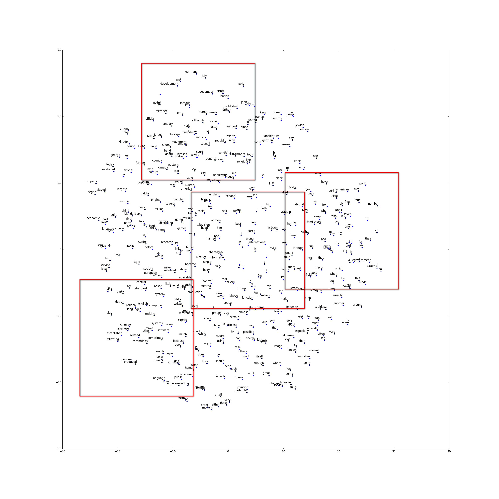
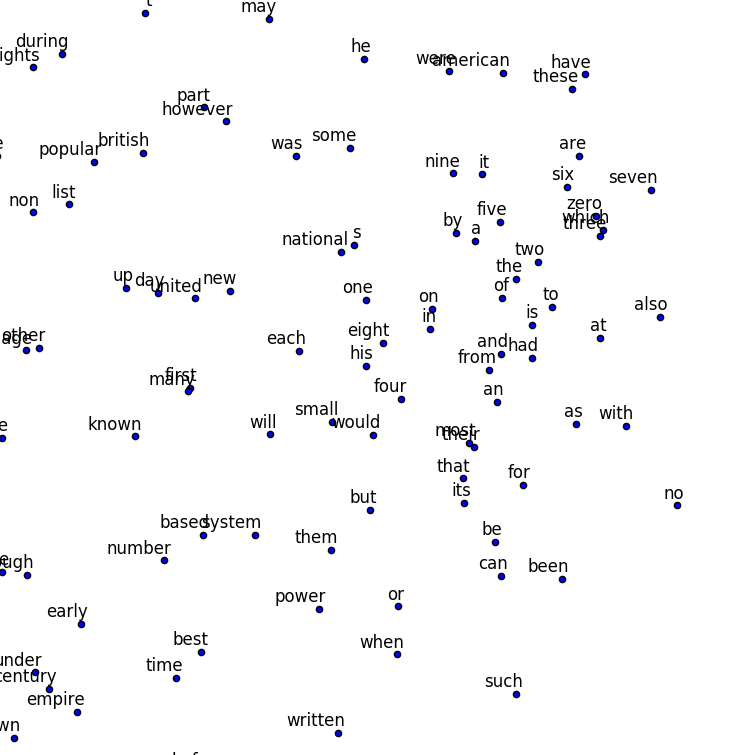

### word2vec tutorial

Reference paper:
[Mikolov, Tomas, et al. "Distributed representations of words and phrases and their compositionality." Advances in neural information processing systems. 2013.] (http://papers.nips.cc/paper/5021-distributed-representations-of-words-and-phrases-and-their-compositionality.pdf)

Reference of Skip-gram model: 
[Chris McCormick](http://mccormickml.com/2016/04/19/word2vec-tutorial-the-skip-gram-model/)

Reference of File IO and visualization: 
[Tensorflow word2vec tutorial example](https://github.com/tensorflow/tensorflow/blob/master/tensorflow/examples/tutorials/word2vec/word2vec_basic.py)

(논문에서 제공한 말뭉치 주소가 현재 접속이 되지않아 database와 PCA 시각화 함수를 TensorFlow tutorial을 참조함)

### File

word2vec.py: main python file for run. Implement the word2vec with NEG-128 use 10^-5 subsampling.

base.py: module of functions

### Result Visualization

Crop:

You can see the numeric words are clustered.
